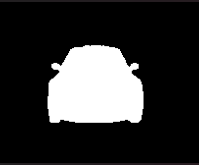

# 🚗 Carvana Image Masking: Custom U-Net Implementation in PyTorch

## 📌 Project Overview
This repository contains a from-scratch PyTorch implementation of the **U-Net** architecture for high-resolution image segmentation, specifically applied to the Carvana Image Masking Challenge dataset. The primary goal is to accurately separate cars from their backgrounds using a robust, custom-built deep learning pipeline.

## 🖼️ Results: Model Performance on a Validation Sample

| Original Image | Ground Truth Mask | U-Net Prediction |
| :---: | :---: | :---: |
|  |  |  |

**Performance Metrics on Validation Set (Strictly Isolated):**
* **Accuracy:** 99.56%
* **Dice Score:** 0.988

## 🚀 Key Features & Engineering Highlights
As a deep learning researcher, I focused on building a scalable and optimized pipeline rather than just a working model:
* **Custom U-Net Architecture:** Fully custom `nn.Module` implementation of the U-Net with DoubleConv blocks, proper skip connections, and dynamic tensor interpolation to handle dimension mismatches.
* **High-Performance Training (AMP):** Utilized `torch.amp.GradScaler` for Automatic Mixed Precision training, significantly accelerating convergence and reducing VRAM usage on CUDA devices.
* **Advanced Data Augmentation:** Integrated `Albumentations` for robust, vectorized augmentations (Elastic rotations, flips, scaling) instead of standard slow torchvision transforms.
* **Modular Design:** Clean separation of concerns across `model.py`, `dataset.py`, `train.py`, and `utils.py`.
* **Evaluation Metrics:** Implemented custom Dice Coefficient scoring alongside pixel-level accuracy to effectively evaluate boundary precision.

## 📂 Repository Structure
```text
├── dataset.py      # Custom PyTorch Dataset handling images and .gif masks
├── model.py        # U-Net architecture built from scratch
├── train.py        # Main training loop with AMP and Albumentations
├── utils.py        # Helper functions (Dice score, checkpoints, loaders)
└── requirements.txt